We have a lot of exceptions for different situations.
They are split into different subclasses for `ConnectionPool`, `Connection`, `Transaction` and `Cursor`.

You can use them to define code behavior based on exceptions.

## Exceptions dependency:

```mermaid

stateDiagram-v2
    RustPSQLDriverPyBaseError --> BaseConnectionPoolError
    RustPSQLDriverPyBaseError --> BaseConnectionError
    RustPSQLDriverPyBaseError --> BaseTransactionError
    RustPSQLDriverPyBaseError --> BaseCursorError
    RustPSQLDriverPyBaseError --> RustException
    RustPSQLDriverPyBaseError --> RustToPyValueMappingError
    RustPSQLDriverPyBaseError --> PyToRustValueMappingError
    RustPSQLDriverPyBaseError --> UUIDValueConvertError
    RustPSQLDriverPyBaseError --> MacAddrConversionError

    state BaseConnectionPoolError {
        [*] --> ConnectionPoolBuildError
        [*] --> ConnectionPoolConfigurationError
        [*] --> ConnectionPoolExecuteError
    }
    state BaseConnectionError {
        [*] --> ConnectionExecuteError
        [*] --> ConnectionClosedError
    }
    state BaseTransactionError {
        [*] --> TransactionBeginError
        [*] --> TransactionCommitError
        [*] --> TransactionRollbackError
        [*] --> TransactionSavepointError
        [*] --> TransactionExecuteError
        [*] --> TransactionClosedError
    }
    state BaseCursorError {
        [*] --> CursorStartError
        [*] --> CursorCloseError
        [*] --> CursorFetchError
        [*] --> CursorClosedError
    }
    state RustException {
        [*] --> DriverError
        [*] --> MacAddrParseError
        [*] --> RuntimeJoinError
    }
```

## Exceptions:
### RustPSQLDriverPyBaseError
Main bas exception for all errors.

### RustToPyValueMappingError
Error if it is not possible to covert rust type to python.

You can get it if you database contains data type that it not supported by this library.

### PyToRustValueMappingError
Error if it is not possible to covert python type to rust.

You can get this exception when executing queries with parameters. So, if there are no parameters for the query, don't handle this error.

### UUIDValueConvertError
Error if it's impossible to convert py string UUID into rust UUID.

### MacAddrConversionError
Error if cannot convert MacAddr string value to rust type.

### BaseConnectionPoolError
Base error for all Connection Pool errors.

#### ConnectionPoolBuildError
Error for errors in building connection pool.

#### ConnectionPoolConfigurationError
Error in connection pool configuration.

#### ConnectionPoolExecuteError
Error in connection pool execution.

### BaseConnectionError
Base error for Connection errors.

#### ConnectionExecuteError
Error in connection execution.

#### ConnectionClosedError
Error if underlying connection is closed.

### BaseTransactionError
Base error for all transaction errors.

#### TransactionBeginError
Error in transaction begin.

#### TransactionCommitError
Error in transaction commit.

#### TransactionRollbackError
Error in transaction rollback.

#### TransactionSavepointError
Error in transaction savepoint.

#### TransactionExecuteError
Error in transaction execution.

#### TransactionClosedError
Error if underlying connection is closed.

### BaseCursorError
Base error for Cursor errors.

#### CursorStartError
Error in cursor declare.

#### CursorCloseError
Error in cursor close.

#### CursorFetchError
Error in cursor fetch (any fetch).

#### CursorClosedError
Error if underlying connection is closed.
